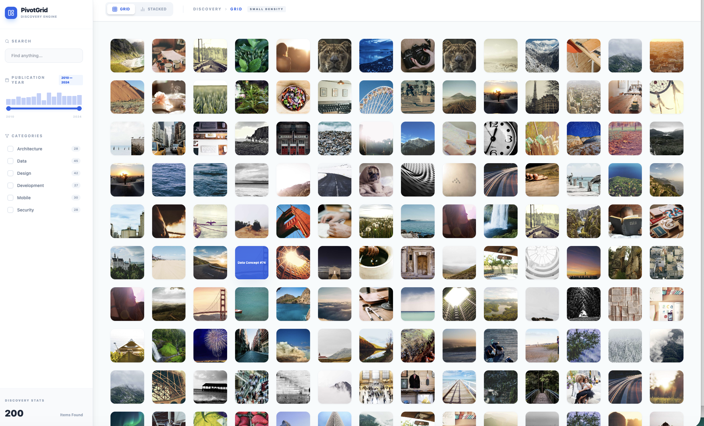
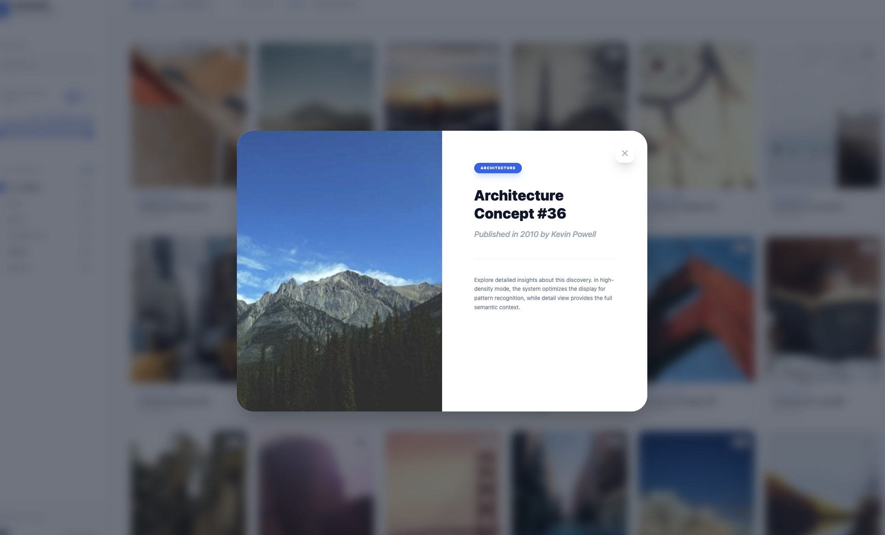
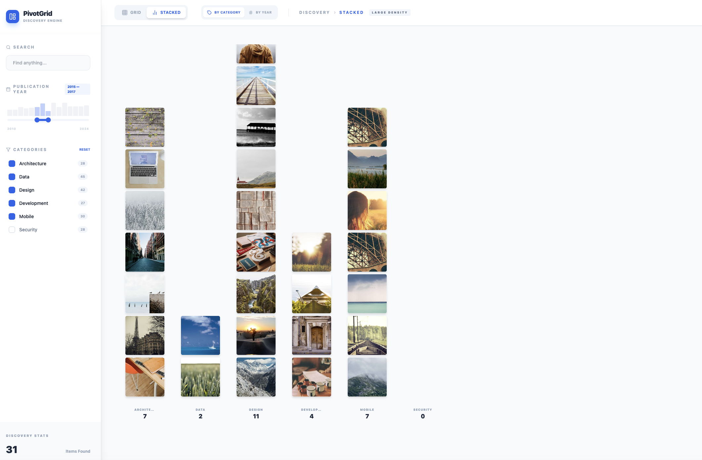
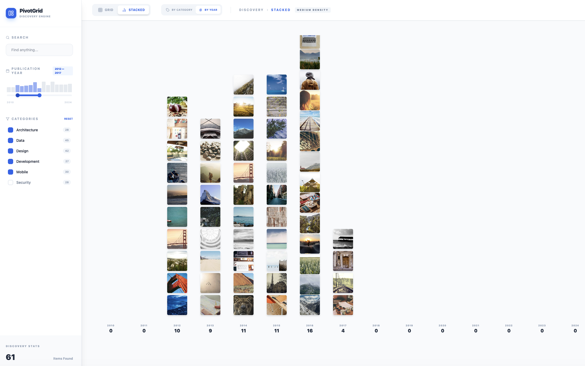

# PivotGrid Mini

A modern reimagination of Microsoft Silverlight PivotViewer, built with React + Vite + Tailwind CSS + Framer Motion.

## Screenshots

### Grid View — Small Density (200 items)

All 200 items displayed in a high-density grid. Card size auto-scales based on viewport area and item count.



### Detail Modal

Click any card to open a full detail view with smooth layout animation (`layoutId` transition).



### Stacked View — By Category

Items grouped by category in a bar-chart style layout. Year range filtered to 2015–2017, showing 31 items across 6 categories.



### Stacked View — By Year

Items grouped by publication year. Negative-margin stacking keeps tall columns within viewport bounds.



## Features

- **Viewport-Aware Dynamic Scaling** — Card size adapts to screen dimensions and item count using `sqrt(area * 0.8 / N)` formula
- **3-Level Semantic Disclosure** — Large (full info), Medium (title + year), Small (image only, hover overlay)
- **Faceted Navigation** — Category checkboxes + histogram range slider for publication year
- **Stacked View** — Group by category or year with adaptive overlap stacking
- **FLIP Animations** — Framer Motion `layoutId` for seamless transitions between grid, stacked, and detail views

## Tech Stack

| Technology | Purpose |
|---|---|
| React 18 | UI framework |
| Vite 5 | Build tool |
| Tailwind CSS 3 | Styling |
| Framer Motion 11 | Layout animations |
| Lucide React | Icons |
| TypeScript | Type safety |

## Getting Started

```bash
npm install
npm run dev
```

## Roadmap

See [docs/development_roadmap.md](docs/development_roadmap.md) for the full implementation plan, including:

- Multi-level sorting
- CSV/Excel drag-and-drop data import
- Virtualization for 1000+ items
- Semantic zoom (Deep Zoom style)

## Architecture

See [docs/dynamic_layout_strategy.md](docs/dynamic_layout_strategy.md) for the viewport-aware scaling strategy.
